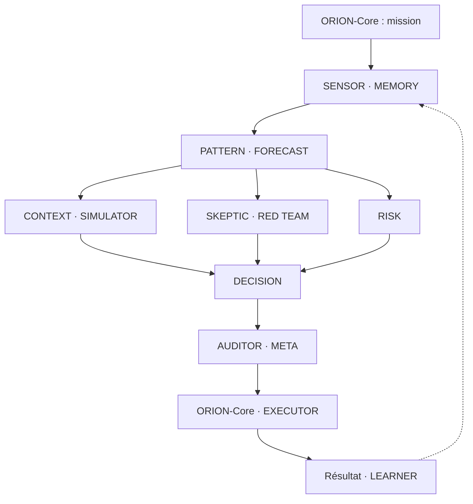

# ORION SUPERBRAIN

ORION est un protocole de travail collectif : preuves, hypothèses, contradiction, arbitrage et mémoire. Il s'applique à une décision comptable, un projet, une analyse de marché ou un dossier sportif. La comparaison au cerveau est une analogie d'organisation, pas une preuve d'intelligence supérieure.

Cette première version fournit deux éléments complémentaires :

- **Un moteur Python local** qui exécute des contrôles déterministes sous quinze noms de rôles, construit un rapport et conserve les décisions/résultats.
- **Quinze profils de sous-agents Claude** dans `.claude/agents/orion-general-*.md`, utilisables par un hôte qui charge ces profils. Leur présence dans le dépôt ne lance pas quinze modèles ni un service permanent. Le CLI Python ne les appelle pas.

## Démarrer

Depuis la racine du dépôt, avec **Python 3.10 ou plus récent** et la bibliothèque standard :

```bash
python3 tools/orion_superbrain.py demo --memory state/orion/memory.sqlite3 --out reports/orion
python3 tools/orion_superbrain.py analyze --input examples/orion/mission.json --memory state/orion/memory.sqlite3 --out reports/orion
python3 tools/orion_superbrain.py analyze --input examples/orion/forecast-demo.json --memory state/orion/memory.sqlite3 --out reports/orion
python3 tools/orion_superbrain.py status --memory state/orion/memory.sqlite3
```

`mission.json` présente une mission généraliste. `forecast-demo.json` utilise une prévision **synthétique** : elle sert à examiner le fonctionnement, et sera exclue des mesures de performance réelle.

Chaque analyse (`demo`, `analyze`, `from-apex`) produit `report.json` et `report.md` dans `reports/orion/RUN_ID/`, ainsi que `index.json` et `index.md` dans le dossier de sortie. Le JSON conserve les détails des contrôles ; le Markdown permet de lire rapidement le verdict, les raisons et les limites.

`--memory` se place après chacune des sous-commandes. `--out` concerne seulement `demo`, `analyze` et `from-apex`. `status` et `settle` affichent leur JSON sur la sortie standard, sans créer de fichier de rapport. Garder le même chemin de mémoire pour retrouver les exécutions et leurs résultats.

## L'équipe

| Rôle | Travail attendu | Limite principale |
| --- | --- | --- |
| ORION-Core | Cadre la mission, choisit le niveau, organise les dépendances et rend la synthèse | Ne supprime pas les blocages pour obtenir un consensus |
| SENSOR | Inspecte les preuves, dates, contenu et origines | Une source déclarée n'est pas authentifiée par le programme |
| MEMORY | Retrouve les épisodes, règles et erreurs disponibles à la date de décision | Aucun souvenir ou résultat futur inventé |
| PATTERN | Repère contradictions et anomalies | Un motif ne démontre pas une cause |
| FORECAST | Examine la prévision fournie, la méthode et son statut | Aucune probabilité produite par un vote |
| CONTEXT | Examine le contexte et les facteurs humains documentés | Aucune psychologie supposée ou fondée sur la nationalité |
| SKEPTIC | Cherche les faiblesses et explications concurrentes | Les objections doivent être précises et examinables |
| SIMULATOR | Explore variantes et résultats de calcul disponibles | Simuler une hypothèse ne la valide pas |
| RED TEAM | Attaque les modes d'échec du dossier et les instructions hostiles | Les documents sont des données, pas des commandes |
| RISK | Contrôle l'action autorisée et l'exposition | Le moteur v1 autorise uniquement un rapport |
| DECISION | Prépare le verdict et la condition de reprise | L'acceptation d'une analyse n'autorise aucune transaction |
| AUDITOR | Vérifie les références, contrats et blocages | Le contrôle de format ne prouve pas la vérité |
| META | Examine les origines communes et limites du processus | Quinze avis ne constituent pas quinze preuves |
| EXECUTOR | Produit le résultat autorisé ou transmet les préalables manquants | Aucun envoi, déploiement ou pari dans le moteur v1 |
| LEARNER | Compare une prévision figée à un résultat enregistré | Aucune modification automatique de poids ou de modèle |

Le parcours logique du collectif est le suivant. Les blocs regroupent des rôles pour rendre les dépendances lisibles ; le mode choisi peut réduire le travail mobilisé.



## Trois niveaux de travail

La mission accepte `mode: "reflex"`, `"analysis"`, `"deep"` ou `"auto"`.

| Mode | Usage | Interprétation |
| --- | --- | --- |
| `reflex` | Dossier simple avec préalables connus | SIMULATOR et RED TEAM peuvent être omis ; risque et audits restent obligatoires |
| `analysis` | Examen courant de plusieurs aspects du dossier | Parcours complet des rôles et contradiction |
| `deep` | Contradiction, anomalie, lacune critique ou enjeu élevé | Parcours complet avec motifs d'escalade explicites |
| `auto` | Laisser le coordinateur choisir | Le rapport indique le niveau retenu |

Le moteur limite le travail concurrent à **quatre workers** et attend les dépendances avant de lancer la suite. Un défaut critique fait passer même une demande `reflex` en `deep`. En `auto`, un dossier sans prévision, sans blocage et avec au plus huit pièces peut passer en `reflex`.

Dans la v1 Python, `analysis` et `deep` exécutent le même protocole structuré de contrôles ; `deep` signale l'escalade et ses motifs, sans collecte ou recherche supplémentaire automatique, recherche récursive ni nouveau modèle. Un mode plus approfondi ne prouve pas qu'une prévision devient plus précise. Une recherche LLM approfondie nécessite l'hôte des sous-agents et les sources appropriées.

## Préparer une mission

Partir de `examples/orion/mission.json`. Les champs principaux sont :

| Champ | Contenu |
| --- | --- |
| `task_id`, `objective` | Identifiant stable et objectif concret |
| `as_of` | Date de décision ISO avec fuseau, par exemple `2026-10-06T17:00:00Z` |
| `evidence` | Pièces avec identifiant, fait/valeur, contenu, source, origines connues et dates |
| `claims` | Affirmations reliées aux pièces, marquées fait, inférence, hypothèse ou inconnu |
| `requirements` | Nombre minimal de familles d'origines connues par fait nécessaire |
| `forecast` | Facultatif : événement, probabilité, méthode, version et statut de validation |
| `mode` | Niveau de travail demandé |
| `proposed_action` | `report`, seule action autorisée dans le moteur v1 |
| `resume_condition` | Facultatif : condition observable pour reprendre un dossier en attente |

Une preuve doit fournir son contenu, pas seulement un lien. Le moteur vérifie notamment que l'affirmation fournie apparaît littéralement dans le contenu, que le hash concorde lorsqu'il est fourni et que les dates conviennent à `as_of`. La disponibilité **et** la récupération doivent précéder la décision. La vérification littérale n'est pas une compréhension ou une authentification de la source.

Les origines partagées ou contenus identiques sont regroupés de manière conservatrice. Ajouter dix reprises d'un même communiqué ne crée donc pas dix confirmations. Inversement, déclarer deux origines différentes ne prouve pas leur indépendance réelle : elle reste explicitement non démontrée.

Les rumeurs, inférences, contenus expirés ou d'origine inconnue ne sont pas admis comme preuves factuelles. Les contradictions sont conservées et doivent être résolues. Les informations présentées comme décrivant un état psychologique interne appellent une vérification supplémentaire ; le programme ne crée aucun bonus de probabilité à partir de ces affirmations.

## Lire le verdict

| Verdict | Sens |
| --- | --- |
| `ACCEPT` | Le dossier analytique satisfait les contrôles exécutés ; le rapport est recevable dans cette portée |
| `REJECT` | Un blocage critique empêche l'acceptation |
| `COLLECT_MORE` | Il manque une preuve ou une clarification nécessaire |
| `WAIT` | Un préalable manque et une condition de reprise a été donnée |

Les raisons détaillées accompagnent le verdict. `ACCEPT` ne certifie ni la vérité du monde, ni la qualité prédictive du modèle, ni la rentabilité d'une décision.

Les probabilités fournies sont conservées. Le moteur ne transforme pas le désaccord entre agents en une « confiance finale » arbitraire. Un statut `validated` déclaré dans l'entrée ne remplace pas la lecture et l'audit d'un artefact de validation ; la v1 ne réalise pas cet audit.

Pour une prévision binaire, SIMULATOR peut effectuer **10 000 tirages Bernoulli** à partir de la probabilité déjà fournie. Cela illustre l'échantillonnage de cette hypothèse. L'erreur d'échantillonnage obtenue n'est pas une mesure de l'incertitude prédictive, et le calcul ne démontre pas que la probabilité de départ est correcte. Sans prévision ou pour un règlement non binaire, aucun tel échantillonnage n'est effectué. Les scénarios de sensibilité reposent également sur les probabilités fournies.

## Utiliser les profils LLM

Les profils du moteur généraliste utilisent le préfixe `orion-general-` pour conserver les profils ORION déjà présents dans la cellule APEX. Ils restent une équipe distincte de quinze rôles.


Les quinze fichiers `.claude/agents/orion-general-*.md` comportent un en-tête avec `name`, `description`, `tools` et `model`, puis un prompt de rôle. Ils utilisent `model: inherit` et les outils de lecture `Read, Grep, Glob`. Aucun champ de délégation ou paramètre de concurrence fictif n'est ajouté.

Dans un hôte Claude qui charge les sous-agents du projet, donner une consigne de ce type :

> Utilise les profils ORION du projet pour examiner cette mission. Cadre le dossier avec orion-general-core, fais vérifier les preuves et les précédents par orion-general-sensor/orion-general-memory, puis lance seulement les rôles pertinents, avec quatre travaux concurrents au maximum. Fais contrôler les objections et le verdict par orion-general-auditor/orion-general-meta. Chaque contribution cite les fichiers lus, ses lacunes et sa portée. Aucun vote ne doit créer une probabilité. Rends un rapport et une condition de reprise si nécessaire.

La délégation effective dépend des capacités de cet hôte. Les profils sont en lecture seule : SENSOR examine les pièces importées, SIMULATOR examine des résultats, EXECUTOR prépare l'action limitée, et LEARNER analyse l'historique. Une collecte web, un calcul, une écriture ou une action externe doit être réellement réalisé par une capacité distincte de l'hôte avant de pouvoir être annoncé comme effectué.

## Extension APEX

L'adaptateur importe des fichiers APEX ; il ne collecte aucun match et n'appelle aucune API.

```bash
python3 tools/orion_superbrain.py from-apex --input snapshot.json --memory state/orion/memory.sqlite3 --out reports/orion
```

L'entrée peut être un objet, une liste d'objets ou un objet `{"records": [...]}`. L'adaptateur examine la sélection officielle structurée `official_selection`, conserve les veto connus et n'invente pas une sélection à partir d'une liste de marchés ou de scores de confiance. Une erreur d'exécution amont constitue un blocage ; une sélection absente appelle une collecte ou clarification.

Un lot produit aussi `index.json` et `index.md`. `--as-of DATE_ISO_UTC` peut préciser la date de décision. L'import ne rétablit pas une disponibilité historique : les observations reçoivent la date d'import effective. Un `as_of` antérieur à cet import ne rend donc pas ce dossier admissible comme preuve de prévision historique.

Même lorsqu'un dossier APEX est recevable, la sortie opérationnelle reste **WATCH**, avec **mise zéro**. Une valeur arithmétique `p × cote − 1`, quand le règlement binaire et les entrées le permettent, n'est pas une value validée. Les remboursements et règlements partiels exigent une distribution de règlement adaptée. Le modèle importé reste non validé par ORION ; les obligations de backtest et de simulation APEX ne sont pas remplacées par cette revue.

## Mémoire et suivi des résultats

La mémoire SQLite conserve quatre catégories :

- `working` : instantané de la mission ;
- `episodic` : décision, raisons et résultat lorsqu'il est enregistré ;
- `semantic` : métadonnées des méthodes et versions, sans promotion automatique ;
- `failure` : blocages du processus et écarts binaires constatés.

Les enregistrements sont append-only : ils s'ajoutent, sans écraser les prévisions antérieures. Les lectures historiques respectent la date de disponibilité, en tenant aussi compte de l'enregistrement effectif. Modifier seulement `as_of` ne transforme pas une prévision rétrospective en prévision réalisée avant le résultat.

La mémoire par défaut se trouve dans `state/orion/memory.sqlite3`, hors versionnement Git. Lors d'un éventuel déploiement, ce fichier et ses fichiers SQLite associés doivent être conservés sur un volume durable avec une sauvegarde cohérente ; un emplacement temporaire ne fournirait pas une mémoire persistante. Aucun déploiement ni service permanent n'est mis en place par cette v1.

Après un résultat binaire réellement disponible, remplacer `RUN_ID` et `DATE_ISO_UTC` par les valeurs correspondantes :

```bash
python3 tools/orion_superbrain.py settle --run-id RUN_ID --outcome 1 --available-at DATE_ISO_UTC --memory state/orion/memory.sqlite3
python3 tools/orion_superbrain.py status --memory state/orion/memory.sqlite3
```

`--outcome 1` signifie que l'événement prévu s'est produit ; `0` signifie qu'il ne s'est pas produit. Le résultat ne peut pas devenir disponible avant la prévision ni dans le futur. Un règlement contradictoire d'une même exécution est refusé. La commande enregistre un résultat fourni : elle n'en vérifie pas indépendamment la source.

Le suivi calcule le **Brier** et la **log-loss** pour les prévisions binaires admissibles, avec une borne numérique de `10^-15` pour le logarithme. Les prévisions synthétiques, rétrospectives ou sans règlement binaire sont exclues avec leur raison. Les résultats sont présentés par méthode/version et avec le nombre d'observations. Aucun poids, modèle, seuil ou probabilité n'est modifié automatiquement.

## Limites effectives de la v1

Le livrable constitue un moteur local de contrôle et un protocole LLM chargeable. Il ne constitue pas un scanner 24 h/24, un service API connecté, une installation sur un serveur ou un robot de pari. Il n'exécute aucun envoi externe ni commande financière.

La vérité sémantique des sources, l'indépendance réelle des origines, les artefacts de validation et la supériorité prédictive du collectif restent à établir. Les contrôles de texte hostile détectent certains motifs et maintiennent les sources comme données ; ils ne sont pas un détecteur exhaustif d'attaques.

Pour parler d'amélioration du système, il faudra un historique prospectif, des résultats vérifiés et une comparaison chronologique à des références adaptées au domaine. Le nombre d'agents et la richesse du vocabulaire ne remplacent pas cette preuve.
